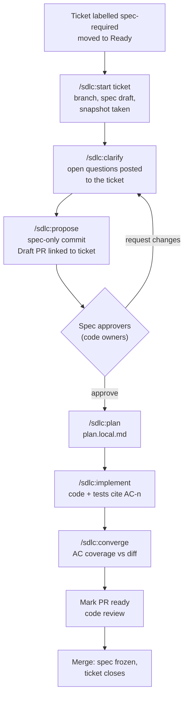
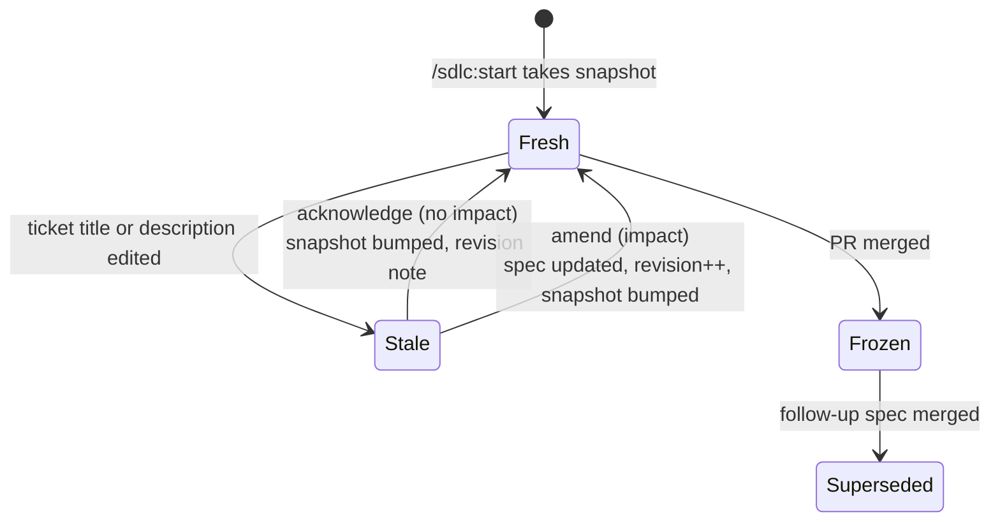
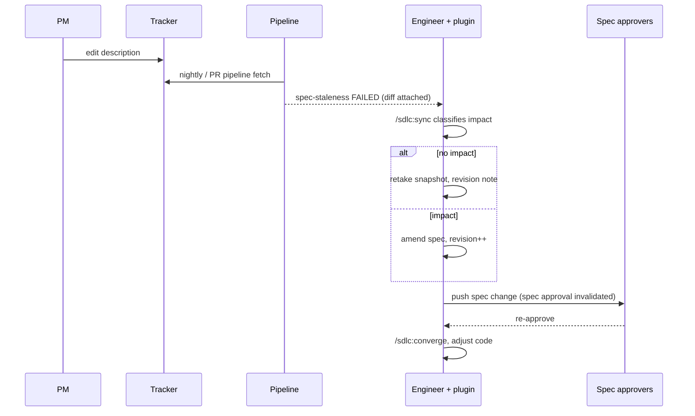

# Team Spec-Driven Workflow

How a team of 30 to 40 engineers sharing one repository applies the AI-native SDLC
(intent, spec, plan, build, review) without a separate spec repo, without asking PMs to
write markdown, and without making a Claude plugin the source of truth.

Works with any combination of:

- **Tracker** (where tickets live): GitLab Issues, GitHub Issues, Linear.
- **Code host** (where code and review live): GitLab, GitHub.

- Status: draft for team discussion
- Based on: [The AI-native SDLC playbook](https://claude.com/blog/the-ai-native-sdlc-playbook)

### Vocabulary

| Term | Means |
|---|---|
| **Ticket** | A GitLab issue, GitHub issue or Linear issue |
| **Ticket key** | `123` (GitLab/GitHub, same project), `group/project#123` or `org/repo#123` (other project), `ENG-123` (Linear) |
| **PR** | A GitHub pull request or a GitLab merge request. "Draft PR" covers both drafts |
| **Code owners** | The `CODEOWNERS` mechanism on either code host |
| **Pipeline** | GitLab CI or GitHub Actions |

---

## 1. What we change from the playbook

The playbook describes a chain of committed files: `intent.md` → `spec.md` → `plan.md` →
code. That chain works for one engineer or for an autonomous loop. It gets expensive in a
shared repo:

- **`intent.md` duplicates the ticket.** Two human-maintained sources of truth for the same
  intent means someone has to keep them in sync, and nobody will.
- **PMs don't write markdown in git**, and shouldn't have to.
- **Separate artifacts with separate approvals** multiply PRs and review rounds.
- **Committed plans go stale** and are noise for everyone who isn't the implementer.
- **The playbook only measures requirement changes after the fact** (spec commits dated
  after the plan). It doesn't manage them while the work is in flight.

Our revision:

| Playbook artifact | Our equivalent | Owner | Lives in |
|---|---|---|---|
| `intent.md` | **The ticket** (title + description) | PM / ticket author | Tracker |
| `spec.md` | `specs/<ticket-key>-<slug>/spec.md` | Engineer writes, approver approves | Product repo, same PR as the code |
| `plan.md` | `plan.local.md`, not committed by default | Engineer | Local working copy (gitignored) |
| Code + tests | Code + tests | Engineer | Same PR |
| Approval log | PR reviews + code owners | Code host | PR history |
| Audit trail | Ticket ↔ branch ↔ PR ↔ commits ↔ spec | Tracker/code-host links + commit trailers | Git + tracker + code host |

### Principles

1. **The ticket is the intent.** Nobody maintains a copy of it. The spec records *which
   version* of the ticket it was written against: a content hash, plus a generated,
   never-edited snapshot file used as evidence and for diffs (section 3.3).
2. **Direction of truth is ticket → spec → code.** A scope change discovered during
   implementation goes back into the ticket first, then flows down. The spec never silently
   drifts from the ticket.
3. **The tracker, the code host and the repo are the source of truth. The plugin is a
   helper.** Anything that must hold is enforced by the pipeline, because not everyone will
   use the plugin, and a rule only the plugin knows is a rule half the team never sees.
4. **Don't store in files what the code host already knows.** Approvers, approval state
   and merge state live in the PR. The spec frontmatter never claims `approved`, because
   that claim would drift from the PR.
5. **Governance proportionate to risk.** Only tickets labelled `spec-required` get a spec.
   A one-line fix with an empty spec is a tax that teaches people to route around the process.
6. **Merged specs are frozen records.** A later change to the same behaviour gets a new
   ticket and a new spec that `supersedes` the old one.
7. **Platform differences live in adapters, not in the process.** The workflow below is the
   same on every tracker and code host; section 10 maps each step to each system.

---

## 2. Repository layout

We always use a directory per ticket, even when it only holds `spec.md`. Tickets that
earn a spec are the substantial ones, and those are the ones that grow attachments (threat
model, diagrams, API schemas, mockups). One shape forever means pipeline globs, links from
the ticket and tooling never change.

```
<repo>/
├── specs/                                  # or .specs/ (see Open decisions)
│   ├── README.md                           # this workflow, short version
│   ├── config.yml                          # which tracker and code host, see 2.1
│   ├── 123-prorate-plan-changes/           # GitLab / GitHub ticket
│   │   ├── spec.md                         # required
│   │   ├── ticket.snapshot.md              # generated, never edited
│   │   ├── threat-model.md                 # optional
│   │   ├── sequence.png                    # optional, linked from spec.md
│   │   ├── api.yaml                        # optional
│   │   └── plan.local.md                   # gitignored, engineer's working plan
│   └── eng-131-webhook-retries/            # Linear ticket
│       ├── spec.md
│       └── ticket.snapshot.md
├── CODEOWNERS                              # .gitlab/ or .github/ also valid
├── <PR template>                           # see section 10
├── tools/specs/                            # shared scripts, see 9.4
└── .gitignore                              # includes: specs/**/*.local.md
```

**Directory naming:** `<ticket-key>-<kebab-slug>`, lowercased:

| Tracker | Ticket | Directory | Branch |
|---|---|---|---|
| GitLab / GitHub, same project | `#123` | `123-prorate-plan-changes` | `123-prorate-plan-changes` (what both hosts generate from the issue) |
| GitLab / GitHub, other project | `billing/api#123` | `billing-api-123-prorate-plan-changes` | same |
| Linear | `ENG-131` | `eng-131-webhook-retries` | `eng-131-webhook-retries` (set Linear's branch format to drop the username prefix) |

**Plans:** `plan.local.md` is ignored by git on purpose. If a team decides a particular
change deserves a committed plan (for example a multi-PR migration), rename it `plan.md`
and commit it deliberately. The default is not to.

### 2.1 `specs/config.yml`

The only place the systems are named. The plugin and the pipeline scripts read it.

```yaml
tracker:
  system: linear            # gitlab | github | linear
  team_key: ENG             # linear only
  project: billing/api      # gitlab/github only, when tickets live in another project
  spec_label: spec-required
code_host:
  system: github            # gitlab | github
  spec_approvers: "@acme/spec-approvers"   # a group, or a list of usernames
specs_dir: specs
```

---

## 3. Spec file format

### 3.1 Frontmatter

```yaml
---
id: 123-prorate-plan-changes
title: Prorate plan changes mid-cycle
ticket:
  system: gitlab                     # gitlab | github | linear
  ref: billing/api#123               # or org/repo#123, or ENG-123
  url: https://gitlab.example.com/billing/api/-/issues/123
  snapshot:
    content_sha256: 9c1e4b...        # sha256 of normalised title + description
    updated_at: 2026-09-23T10:14:00Z # informational only, see 5.1
    taken_by: jdoe
    taken_at: 2026-09-23T11:02:00Z
revision: 2                          # bumped on every content change after first review
state: active                        # active | superseded
supersedes: []                       # e.g. [88-plan-change-billing]
superseded_by: null                  # set by the PR that supersedes this spec
related:
  - billing/api#117
attachments:
  - threat-model.md
  - sequence.png
---
```

Field rules:

| Field | Why it exists | Who sets it |
|---|---|---|
| `id` | Stable handle used in commit trailers and cross-links | Plugin at creation |
| `ticket.system` / `ref` / `url` | Link back to the intent, on whatever tracker holds it | Plugin at creation |
| `ticket.snapshot.content_sha256` | **The staleness anchor.** Compared against the live ticket by the pipeline | Plugin, on creation and on every sync or acknowledgement |
| `ticket.snapshot.updated_at` | Human-readable context. Not used for staleness (labels, assignees and comments bump it on every tracker) | Plugin |
| `taken_by` / `taken_at` | Who last confirmed the spec matches the ticket, and when | Plugin |
| `revision` | Lets people say "spec r3" in comments and trailers | Plugin / engineer |
| `state` | Only lifecycle the code host can't express: superseded | The superseding PR |
| `supersedes` / `superseded_by` | Chain of custody across tickets | Plugin |

Deliberately **absent**: `status: approved`, `approvers`, `pr`. The PR is found from the
branch and the ticket; approval state is read from the code host. Storing them would
create a second, drifting copy.

### 3.2 Body template

```markdown
# Prorate plan changes mid-cycle

> Intent: [billing/api#123](https://gitlab.example.com/billing/api/-/issues/123).
> This spec does not restate the ticket; read it first.

## Context
What exists today and why the ticket needs more than the ticket says.

## Goals
## Non-goals

## Acceptance criteria
- **AC-1** Upgrading mid-cycle charges the prorated difference immediately.
- **AC-2** Downgrading mid-cycle issues a credit applied to the next invoice.
- **AC-3** Proration uses the subscription's billing anchor, not the calendar month.

## Design
Approach, data model changes, API changes, alternatives considered and why rejected.

## Risks and security
Link `threat-model.md` when the change crosses a trust boundary.

## Rollout and migration

## Open questions
Each one names who must answer it. The spec is not approvable with open questions left.

## Decisions
- 2026-09-24: Credits never expire. Source: [comment on the ticket](https://...)

## Revisions
- **r2** (2026-09-26, jdoe): Ticket updated to exclude annual plans. Non-goals and AC-3
  updated. Trigger: ticket-updated.
- **r1** (2026-09-23, jdoe): Initial spec.
```

Two conventions carry most of the traceability:

- **Acceptance criteria have stable IDs (`AC-n`).** Tests, commits and review comments cite
  them. An AC is never renumbered; a removed AC is struck through with a reason.
- **Decisions made in ticket comments are folded in with a link.** A decision that exists
  only in a comment thread is invisible to the next reader and to the staleness check.

### 3.3 `ticket.snapshot.md`

Generated by the plugin whenever the snapshot hash is taken; never edited by hand
(`spec-lint` rejects a snapshot file whose hash doesn't match the frontmatter).

```markdown
<!-- generated by tools/specs; do not edit -->
<!-- ticket: billing/api#123  sha256: 9c1e4b...  taken: 2026-09-23T11:02:00Z -->
# Prorate plan changes mid-cycle

<normalised ticket description>
```

Why keep it, given principle 1:

- **Uniform diffs.** When the ticket changes, the staleness check diffs the live ticket
  against this file. Description history is uneven across trackers (available on some,
  tier-gated on others, missing from some APIs); this makes the diff identical everywhere.
- **Evidence.** It records exactly what intent the spec was approved against, which
  survives the ticket being edited, moved or the tracker being replaced.

It isn't a second source of truth, because nobody writes to it. It's a receipt.

---

## 4. Spec creation flow



### Step by step

1. **Pick up the ticket.** It must carry the `spec-required` label (set at refinement).
   Tickets without it go straight to implementation with a normal PR.
2. **`/sdlc:start <ticket>`**
   - Reads the ticket (title, description, labels, linked tickets, recent comments) through
     the tracker adapter (section 10).
   - Creates the branch from the default branch, named per section 2.
   - Creates `specs/<ticket-key>-<slug>/spec.md` from the template, takes the snapshot
     (frontmatter hash + `ticket.snapshot.md`).
   - Drafts the spec body with Claude, grounded in the ticket and the codebase.
3. **`/sdlc:clarify`** works ambiguities down to decisions. Questions only the PM can answer
   are posted as a single comment on the ticket; answers are folded into `## Decisions` with
   a link. If the answer changes scope, the PM edits the ticket description (principle 2).
4. **`/sdlc:propose`** commits the spec alone and opens a **Draft PR**:
   - Title: `Draft: Spec for <ticket-key>: Prorate plan changes mid-cycle`
   - Description from the PR template, including the closing keyword for the tracker
     (section 10).
   - Commit format in section 7.
5. **Spec approval via code owners.** `CODEOWNERS` routes `specs/` changes to the spec
   approvers. Reviewers read the rendered markdown in the PR and comment inline. PMs never
   touch git; they review in the code host's web UI.
6. **Only after spec approval, start code.** `/sdlc:plan` writes `plan.local.md`;
   `/sdlc:implement` works from the approved spec and the plan. Commits and tests cite
   `AC-n`.
7. **`/sdlc:converge`** before marking the PR ready: every AC has evidence (test, code),
   and every changed file is justified by some AC. Findings go in a PR comment.
8. **Mark ready, code review, merge.** The spec on the default branch is now the frozen
   record of this change.

### Code owners and approval

`CODEOWNERS` (same syntax on both hosts for this use):

```
/specs/ @acme/spec-approvers
```

What we need from the code host, regardless of which one:

| Requirement | Why |
|---|---|
| **R1** Changes under `specs/` need a spec approver's approval | Spec approval is mandatory, not advisory |
| **R2** Pushing code does **not** invalidate the spec approval | Otherwise every code push forces a spec re-review |
| **R3** Changing the spec **does** invalidate the spec approval | Our amendment mechanism: any later spec edit is re-approved |
| **R4** Required checks pass before merge, evaluated against the merge result | Staleness is checked against the ticket at merge time |
| **R5** The merge commit keeps the traceability trailers | Squashing must not drop the links |

How each host meets them is in section 10. The short version: GitLab meets R3 with a
built-in setting; GitHub can't dismiss approvals per path, so R3 is met by the
`spec-approval` pipeline check (section 6), which works on both hosts and is the portable
default.

**Spec approved before code:** start as a team convention. If it's routinely skipped, add
the optional `spec-gate` job (section 6). Tooling can't fix a culture of "approve
everything at the end"; the team has to agree to review the spec first.

**Who approves:** a group per area (PM, tech lead, or a peer, per team). Approvers must be
eligible on the code host (section 10); check that PMs have the access this requires.

---

## 5. Staleness and convergence

Two directions of drift, two checks.

| Direction | Question | Check | Where it runs |
|---|---|---|---|
| **Upstream**: ticket → spec | Was the spec written against the ticket as it reads now? | `spec-staleness` | Pipeline (hard gate), nightly schedule, `/sdlc:check` locally |
| **Downstream**: spec → code | Does the diff do what the spec says, and only that? | `/sdlc:converge` | Locally before ready; optionally a Claude review job in the pipeline |

### 5.1 Upstream staleness (ticket → spec)

**The anchor is a content hash, not `updated_at`.** On every tracker, `updated_at` moves on
label, assignee, state or comment changes and would make every spec permanently stale.

```
content_sha256 = sha256( normalise(title) + "\n\n" + normalise(description) )
normalise = CRLF→LF, trim trailing whitespace per line, trim leading/trailing blank lines
```

Linear descriptions are markdown like the others; the adapter fetches the markdown field,
not rendered HTML, so the hash is stable.

The algorithm (one script, shared by the pipeline and the plugin, in `tools/specs/`):

1. For every `specs/*/spec.md` changed in the PR, **plus the spec of the PR's own ticket**
   (so a code-only push still gets checked):
2. Fetch the ticket through the tracker adapter, compute `content_sha256`.
3. Equal to `ticket.snapshot.content_sha256` → **fresh**.
4. Different → **stale**. Fail with the diff between `ticket.snapshot.md` and the live
   ticket, and the two resolutions: update the spec, or acknowledge.
5. Specs with `state: superseded` are skipped.

Staleness states:



Both resolutions change `spec.md`, so both invalidate the spec approval (R3). That's
intended: "still valid" is a claim someone other than the author confirms. For an
acknowledgement the diff is a few lines, so the re-approval takes seconds.

### 5.2 Downstream convergence (spec → code)

`/sdlc:converge` reads the approved spec and the PR diff and reports per AC:

| Verdict | Meaning | Action |
|---|---|---|
| `COVERED` | Implementation and a test citing the AC exist | None |
| `UNTESTED` | Implementation found, no test cites the AC | Add the test or justify |
| `MISSING` | No implementation found | Implement, or amend the spec (re-approval) |
| `CONTRADICTED` | Code behaves differently from the AC | Fix the code or amend the spec |
| `UNJUSTIFIED` | Changed files not traceable to any AC | Scope creep: remove, split to another ticket, or amend |

It is **read-only**: it reports, and the engineer decides. It never edits the spec to
match the code, because that turns a finding into a silent amendment.

A deterministic subset can run in the pipeline: every non-struck `AC-n` in the spec is
cited by at least one test, in a test name or comment, as `<ticket-key>:AC-n` (for example
`123:AC-2` or `ENG-123:AC-2`). The ticket key qualifies it because every spec has an AC-1.
Commits don't need the qualifier: their `Spec` trailer already names the spec. The judgement part (`CONTRADICTED`,
`UNJUSTIFIED`) is a Claude review, either locally or via a pipeline review job
(`claude-code-action` on GitHub, or the equivalent job on GitLab).

---

## 6. Pipeline jobs

| Job | Runs when | Blocking | What it does |
|---|---|---|---|
| `spec-required` | PR pipelines | Yes | If the PR's ticket has `spec-required`, a `specs/<ticket-key>-*/spec.md` must exist in the PR or on the default branch |
| `spec-lint` | `specs/**` changed | Yes | Frontmatter schema, required sections, unique never-renumbered `AC-n`, no open questions when not draft, attachments exist, `revision` bumped when body changed, `ticket.snapshot.md` matches the hash |
| `spec-staleness` | PR pipelines, and on the merge result (R4) | Yes | Section 5.1 |
| `spec-approval` | PR pipelines, and on review events | Yes on GitHub, optional on GitLab | R3 made portable: passes only if a spec approver approved the PR **at or after** the last commit touching the spec directory |
| `spec-staleness-nightly` | Scheduled | No | Runs 5.1 over every open PR and comments on stale ones, so drift surfaces before the next push. Also flags merged specs whose ticket changed after merge (section 8, case D) |
| `ac-coverage` | Code changed in a PR with a spec | Warn first, then yes | Deterministic subset of 5.2 |
| `spec-gate` | Optional | Warn | Non-spec files changed before `spec-approval` passed |
| build/test jobs | **Not** on spec-only changes | n/a | Path filters exclude `specs/**`-only pushes, so spec edits don't cost a full pipeline (see the GitHub caveat in section 10) |

Credentials: the staleness jobs need read access to the tracker (and, for Linear, an API
key stored as a pipeline secret); the nightly job needs write access to comment on tickets
and PRs; `spec-approval` needs read access to PR reviews and team membership. On GitHub,
reading team membership needs `read:org`, which the default `GITHUB_TOKEN` lacks: use a
GitHub App token, or list approvers as usernames in `specs/config.yml`.

---

## 7. Commit and PR conventions

Commit history must answer, without opening any other tool: *which ticket, which spec
revision, which acceptance criteria, and why*.

### 7.1 Spec commits

```
spec(123): r2 exclude annual plans from proration

The ticket was updated on 2026-09-26 to exclude annual plans (PM decision in
the refinement call). Non-goals now list annual plans; AC-3 is limited to
monthly anchors. No AC was added or removed.

Refs: billing/api#123
Spec: 123-prorate-plan-changes@r2
Spec-Change: ticket-updated
Ticket-Snapshot: 9c1e4b7
```

`Refs` holds the full ticket reference as the tracker writes it (`billing/api#123`,
`acme/api#123` or `ENG-123`), so the code host and the tracker both auto-link it.

`Spec-Change` is one of `initial`, `review-feedback`, `ticket-updated`,
`ticket-acknowledged`, `implementation-finding`, `supersede`.

### 7.2 Code commits

```
feat(billing): credit mid-cycle downgrades on the next invoice

Downgrades now create a credit line instead of refunding, because refunds
through the payment provider cost a fee per transaction (see spec Design).
The credit is applied before tax.

Refs: ENG-123
Spec: eng-123-prorate-plan-changes@r2
Implements: AC-2
```

Trailers are machine-readable (`git log --format='%(trailers:key=Implements)'`), so
"which commits implemented AC-2" and "which commits were written against spec r1" are
one command each, on any host.

### 7.3 PR

- Title: `Draft: Spec for <ticket-key>: ...` while spec-only, then `<ticket-key>: ...` once
  code lands.
- Description (template): the tracker's closing keyword and ticket reference, a link to the
  spec file on the branch, current revision, the latest `/sdlc:converge` summary, and a
  `## Revisions` excerpt when the spec changed after first approval.
- **Squash policy (R5):** if we squash, the squash message must carry `Refs`, `Spec` and
  the union of `Implements` trailers, or per-commit traceability is lost at merge. The PR
  itself keeps the full history either way. How to configure it per host is in section 10.

---

## 8. When the ticket is updated

Updating the ticket is always legitimate; it's the PM's source of truth. What varies is how
far the work has progressed.

| Case | Where the work is | What happens | Who acts |
|---|---|---|---|
| **A** | No spec yet | Nothing. `/sdlc:start` will snapshot the latest version | n/a |
| **B** | Spec in Draft PR, not yet approved | `/sdlc:sync`: diff the ticket, update the spec, retake the snapshot, bump the revision. Normal review continues | Engineer |
| **C1** | Spec approved, code in progress, change **has no impact** | The pipeline (or nightly comment) flags stale. `/sdlc:sync` classifies as no-impact, retakes the snapshot, adds a revision note with `Spec-Change: ticket-acknowledged`. Spec approvers re-approve a few-line diff | Engineer, then approver |
| **C2** | Spec approved, code in progress, change **has impact** | `/sdlc:sync` proposes the spec changes (which ACs are touched). Engineer amends, `revision++`, `Spec-Change: ticket-updated`. Re-approval, then `/sdlc:converge` shows which code is now `CONTRADICTED` or `MISSING` | Engineer, then approver |
| **D** | PR merged, spec frozen | Don't edit the merged spec. The nightly job comments on the ticket: "this ticket changed after its spec merged; open a follow-up". The follow-up ticket gets a new spec with `supersedes: [<old id>]`; its PR sets `superseded_by` on the old spec | PM opens follow-up, engineer specs it |

Case D matters most on trackers where a closed ticket stays easy to edit (all three).

### Scope change discovered by the engineer

The same flow in reverse order. The engineer finds during implementation that the ticket
is wrong or incomplete:

1. Propose the change on the ticket (comment, or `/sdlc:sync --propose` drafts it).
2. The PM (or the engineer, if the team allows) edits the ticket description.
3. The spec is now stale, which is correct: continue as case C2 with
   `Spec-Change: implementation-finding`.

Never amend the spec first and leave the ticket behind. The ticket stays the intent.



---

## 9. The Claude plugin (`sdlc`)

Built from the SDD plugin's useful commands, minus its personal-workflow assumptions:
no nested spec repo, no phases, no task files, no commit-blocking Stop hooks. The plugin
only reads and writes things that the tracker, the code host and the repo already own.

**Design rules:**

- Every check the plugin runs is the same script the pipeline runs (`tools/specs/`,
  committed in the product repo). The plugin makes the workflow fast; the pipeline makes
  it true.
- Commands never name a system. They call the tracker and code host adapters selected by
  `specs/config.yml`.

### 9.1 Commands

| Command | Based on (SDD) | What it does |
|---|---|---|
| `/sdlc:init` | `bootstrap`, `spec-repo-init` | One-time per repo: ask which tracker and code host, write `specs/config.yml`, `specs/README.md`, the PR template, the `CODEOWNERS` entry, `.gitignore` entry, the pipeline includes for that host, and `tools/specs/`. Writes a short `## Specs` section into `CLAUDE.md` |
| `/sdlc:start <ticket>` | `brainstorm`, `generate-specs` | Read the ticket, create the branch and the spec directory, take the snapshot, draft the spec. `--supersedes <id>` for follow-ups |
| `/sdlc:clarify` | `clarify` | Work open questions down to decisions; post PM-only questions to the ticket as one comment; fold answers into `## Decisions` with links |
| `/sdlc:analyze` | `analyze` | Read-only self-consistency check of one spec: AC vs non-goals, decisions vs design, open questions left, ACs that aren't testable |
| `/sdlc:propose` | new | Commit the spec alone with a 7.1 message, push, open the Draft PR from the template |
| `/sdlc:plan` | `plan` | Write `plan.local.md` from the approved spec. Warns if the spec is not yet approved (reads PR reviews) |
| `/sdlc:implement` | `implement` | Implement from the approved spec and plan, test first, commits cite `AC-n` |
| `/sdlc:check` | new | Run the pipeline's staleness, lint and approval scripts locally; show the ticket diff if stale |
| `/sdlc:sync` | new | Handle a ticket update (section 8): diff, classify impact per AC, propose an acknowledgement or an amendment, retake the snapshot and bump the revision. `--propose` drafts a ticket edit when the engineer found the scope change |
| `/sdlc:converge` | `converge` | Section 5.2: AC coverage vs the diff. Read-only; optionally posts the report as a PR comment |
| `/sdlc:bug` | `bug` | Bug lane: reproduce, diagnose, fix, verify. No spec unless the ticket carries `spec-required` |
| `/sdlc:commit-msg` | `commit-msg` | Commit message with the 7.1 / 7.2 trailers filled from the branch, spec and diff |
| `/sdlc:pr-msg` | `pr-msg` | PR title and description from the spec, revisions and converge report, with the right closing keyword for the tracker |
| `/sdlc:handoff` | `handoff` | When a ticket changes hands: posts the state of the work as a PR comment (not a local file), so the next engineer finds it where the work lives |

Dropped from SDD: `generate-tasks`, `next-task`, `implement-next-task` (the board is the
task list), `quick` (tickets without `spec-required` are the fast lane), `dashboard` (the
tracker's boards and the code host's PR lists are the dashboard), `snapshot`,
`project-overview`, `spec-repo-init`, `preflight` (folded into `init`).

### 9.2 Skills

| Skill | Based on (SDD) | Purpose |
|---|---|---|
| `workflow` | `practices` | This document, condensed: when a ticket earns a spec, the direction of truth, what never goes in a file |
| `spec-template` | `spec-template` | The frontmatter schema and body template of section 3, with guidance per section |
| `tracker-access` | new | Reading tickets and posting comments on GitLab, GitHub or Linear: which CLI or MCP server, ticket key formats, closing keywords, resolving the ticket from the branch |
| `code-host-access` | new | PRs, reviews, approvals and comments on GitLab or GitHub; draft PRs; reading who approved and at which commit |
| `staleness` | `tidying-spec-repos` (converge part) | The snapshot hash definition, the states in 5.1, how to classify impact, what acknowledge vs amend means |
| `commit-conventions` | `commit-msg` | Trailers, `Spec-Change` values, squash rules per host |
| `test-first` | `test-first` | Unchanged: failing test first, tests cite `AC-n` |
| `receiving-review` | `receiving-review` | Unchanged: verify review findings before acting, including spec review comments |
| `finishing-work` | `finishing-work` | Rewritten for PRs: what must be true before marking ready (fresh spec, spec approval current, converge clean, pipeline green) |

### 9.3 Hooks

Light, advisory, never blocking. Enforcement belongs to the pipeline.

| Hook | What it does |
|---|---|
| `SessionStart` | If the branch maps to a ticket with a spec, inject: spec id and revision, approval state, and whether the snapshot is stale. One line, so every session starts knowing where the work stands |
| `PostToolUse` on edits to `specs/**/spec.md` | Remind to bump `revision` and add a `## Revisions` entry when the body changed after first review |

### 9.4 Repository-side tooling (not in the plugin)

`/sdlc:init` vendors one small Python tool into the product repo. Every check is a
subcommand of it, so the pipeline, the nightly job and the plugin run identical code:

```
tools/specs/
├── specs                  # entry point: tools/specs/specs <subcommand>
├── VERSION                # plugin version it was vendored from
├── requirements.txt       # PyYAML only
├── sdlc_specs/
│   ├── cli.py             # lint | staleness | approval | required | coverage |
│   │                      # snapshot | ticket | pr | nightly
│   ├── config.py          # specs/config.yml
│   ├── spec.py            # frontmatter, sections, AC parsing
│   ├── snapshot.py        # normalisation, content hash, ticket.snapshot.md
│   └── adapters/
│       ├── tracker_gitlab.py
│       ├── tracker_github.py
│       ├── tracker_linear.py
│       ├── host_gitlab.py
│       └── host_github.py
└── ci/
    ├── gitlab-ci.yml      # included from .gitlab-ci.yml
    └── github/            # reusable workflows called from .github/workflows/
```

Adapter interface (the whole platform surface):

```python
class Tracker:
    def fetch(self, ref) -> Ticket: ...          # title, description (markdown), labels, url, updated_at
    def comment(self, ref, body) -> None: ...
    def closing_keyword(self, ref) -> str: ...   # "Closes #123", "Fixes ENG-123", ...

class CodeHost:
    def current_pr(self, branch) -> PR: ...
    def reviews(self, pr) -> list[Review]: ...   # reviewer, state, commit reviewed
    def is_member(self, user, group) -> bool: ...
    def comment(self, pr, body) -> None: ...
    def open_draft(self, branch, title, body) -> PR: ...
```

Keeping these in the repo means the rules are versioned with the code they govern, work
for engineers who don't use Claude, and can't disagree between the plugin and the pipeline.

---

## 10. Platform mapping

### 10.1 Tracker

| Concern | GitLab Issues | GitHub Issues | Linear |
|---|---|---|---|
| Ticket key | `#123`, `group/project#123` | `#123`, `org/repo#123` | `ENG-123` |
| Access for plugin | `glab` or GitLab MCP | `gh` or GitHub MCP | Linear MCP or GraphQL API |
| Access for pipeline | Project/group access token (`read_api`, `api` to comment) | `GITHUB_TOKEN` (same repo) or a GitHub App token (other repos) | Linear API key as a pipeline secret |
| `spec-required` marker | Label | Label | Label |
| Branch from ticket | "Create merge request" gives `123-slug` | "Create a branch" gives `123-slug` | Copy git branch name; set the format to drop the username |
| Link PR to ticket | Closing keyword in PR description, or branch name | Closing keyword in PR description | Ticket key in branch name or PR title/description (GitHub/GitLab integration) |
| Closing keyword | `Closes #123` | `Closes #123` | `Fixes ENG-123` (Linear magic words) |
| Close on merge | Native | Native | Integration moves the issue to Done (configurable) |
| Description history | Available, tier-dependent | Via the edit history API | Not relied on; we diff `ticket.snapshot.md` everywhere |

### 10.2 Code host

| Requirement | GitLab | GitHub |
|---|---|---|
| `CODEOWNERS` location | root, `docs/` or `.gitlab/` | root, `docs/` or `.github/` |
| **R1** spec approver required | Protected branch: "require code owner approval" (tier-dependent) | Branch protection or ruleset: "require review from Code Owners" (plan-dependent for private repos) |
| **R2** code pushes keep the spec approval | Turn **off** "Remove all approvals when commits are added" | Turn **off** "Dismiss stale pull request approvals" |
| **R3** spec edits invalidate the spec approval | Turn **on** "Remove approvals by Code Owners if their files changed" (tier-dependent), or use `spec-approval` | No per-path dismissal exists: make `spec-approval` a required check |
| **R4** checks against the merge result | Merged results pipelines + "pipelines must succeed" | Merge queue (checks run on the merge group) + required checks |
| **R5** trailers survive squash | Squash commit message template including the PR description or trailers | "Default squash message: pull request title and description" and keep trailers in the PR description |
| Draft PR | Draft merge request | Draft pull request |
| Code owner eligibility | Needs a project role that allows approving | Code owners need write access to the repo |
| Skip builds on spec-only pushes | `rules: changes` | `paths-ignore`, **but** a required workflow skipped by path filters stays pending and blocks the merge; filter inside the job instead, or make the build job report success when only `specs/**` changed |
| Claude review job | Claude Code in a CI job | `claude-code-action` |

Tier and plan names change; confirm each "tier-dependent" or "plan-dependent" row on our
own instance before rollout.

---

## 11. Open decisions

| Decision | Options | Leaning |
|---|---|---|
| Directory name | `specs/` (visible, searched by default) vs `.specs/` (out of the way; some tools such as `rg` skip hidden paths by default) | Team preference; either works |
| Who approves specs | PM, tech lead, peer, per area | One group to start; per-area routing later (per-ticket directories can't be routed by path, so this needs a label or a field in the frontmatter read by `spec-approval`) |
| Enforce spec-before-code | Convention vs `spec-gate` job | Convention first, measure, then enforce |
| R3 mechanism on GitLab | Built-in code owner reset vs `spec-approval` | `spec-approval` everywhere, for one mechanism across repos |
| Squash merges | Squash with trailer template vs merge commits | Whichever we use today, with R5 configured |
| Per-change vs living specs | Frozen per-ticket specs only, or also a living "how it works today" doc updated in the same PR | Per-change only to start; add living docs when their absence hurts |
| Plugin writes to the ticket | Automatic comments vs engineer-confirmed | Engineer-confirmed |
| Mixed setups | Linear tracker + GitHub/GitLab host is the likely common case; GitLab Issues + GitHub host is unlikely | Support all pairs in the adapters; test the pairs we use |

## 12. How we'll know it works

- **Requirements rework after build starts:** count of `Spec-Change: ticket-updated` and
  `implementation-finding` commits after the first code commit, per PR. From `git log`.
- **Stale at merge:** should be zero; the pipeline blocks it.
- **Spec-first rate:** share of PRs where the spec approval precedes the first code commit.
- **Converge findings at review time:** `UNJUSTIFIED` and `MISSING` counts should fall as
  specs get sharper.
- **Ceremony cost:** median time from Draft PR to spec approval. If it grows past a day,
  the gate is too heavy and people will start skipping it.
