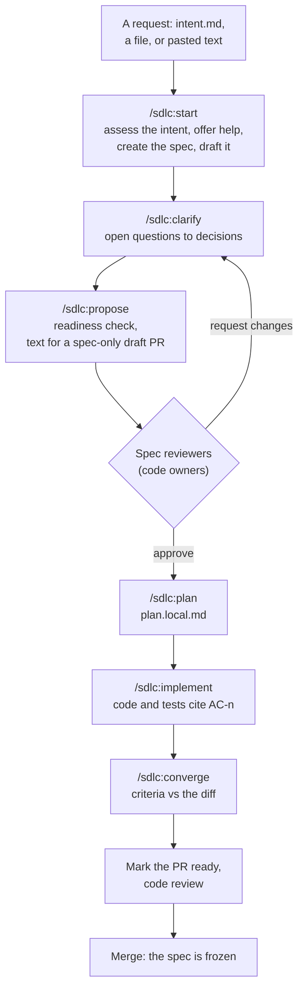
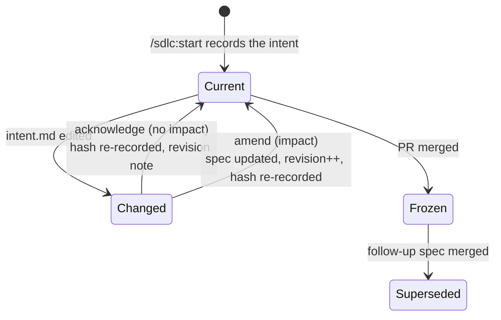
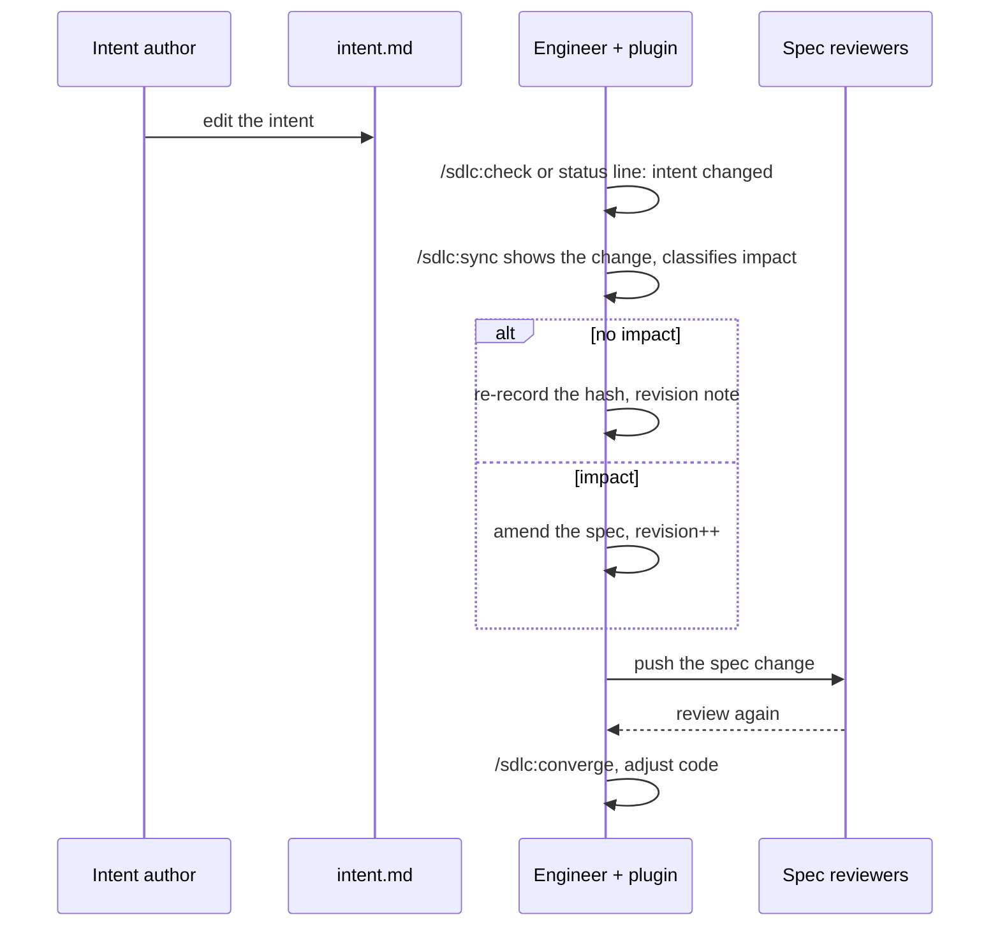

# Team Spec-Driven Workflow

How a team of 30 to 40 engineers sharing one repository applies the AI-native SDLC
(intent, spec, plan, build, review) without a separate spec repo and without making a Claude
plugin the source of truth. This document is guidance: it describes practices the `sdlc`
plugin makes easy, not rules anything enforces.

Works with any code host and tracker; the conventions below mention GitLab, GitHub and Linear
where they differ.

- Status: guidance, first version for the intent-first plugin
- Based on: [The AI-native SDLC playbook](https://claude.com/blog/the-ai-native-sdlc-playbook)

### Vocabulary

| Term | Means |
|---|---|
| **Intent** | `intent.md`: the original request, in the words of whoever has the problem |
| **Spec** | `spec.md`: the contract the team reviews, builds against and cites from tests |
| **Spec id** | The spec's directory name, `YYYY-MM-DD-<slug>`, fixed at creation |
| **PR** | A GitHub pull request or a GitLab merge request. "Draft PR" covers both drafts |
| **Code owners** | The `CODEOWNERS` mechanism on either code host |

---

## 1. What we change from the playbook

The playbook chains committed files: `intent.md` → `spec.md` → `plan.md` → code. That works for
one engineer or an autonomous loop. In a shared repository some of it gets expensive:

- **Separate artifacts with separate approvals** multiply PRs and review rounds.
- **Committed plans go stale** and are noise for everyone who isn't the implementer.
- **Intents arrive in every state.** Tooling that demands a perfect one stalls; tooling that
  ignores quality produces weak specs.
- **Heavy enforcement gets routed around.** A gate a team didn't choose teaches people to
  avoid the process.

Our revision:

| Playbook artifact | Here | Owner | Lives in |
|---|---|---|---|
| `intent.md` | `specs/<id>/intent.md` | Whoever has the problem, helped by Claude | Product repo, same PR as the spec |
| `spec.md` | `specs/<id>/spec.md` | Engineer writes, reviewers approve | Product repo, same PR as the code |
| `plan.md` | `plan.local.md`, not committed by default | Engineer | Local working copy |
| Code and tests | Code and tests | Engineer | Same PR |
| Approval log | PR reviews and code owners | Code host | PR history |
| Audit trail | Spec ↔ commits through trailers | Commit trailers | Git |

### Principles

1. **`spec.md` is the contract; `intent.md` is the original request.** The intent can be
   imperfect. The spec is what is reviewed, built against and cited.
2. **Truth flows intent → spec → code.** When code shows the spec is wrong, the spec is amended
   on purpose, with a new revision, never silently.
3. **The repository and the code host are the source of truth; the plugin is a helper.**
4. **Don't store in files what the code host already knows.** Approvers, approval state and
   merge state live in the PR. A spec never claims `approved`.
5. **Governance proportionate to risk.** Substantial changes get a spec; a one-line fix
   doesn't. That's a team convention.
6. **Merged specs are frozen records.** A later change to the same behaviour gets a new spec
   that `supersedes` the old one.
7. **Offer, don't enforce.** Nothing gates on the quality of an intent, and nothing the plugin
   checks blocks a merge. Checks report; people decide. A team that wants enforcement adds it
   to its own CI (section 6).

---

## 2. Repository layout

One directory per change, even when it only holds a spec: changes that earn a spec are the
substantial ones, and those grow attachments (threat model, diagrams, API schemas).

```
<repo>/
├── specs/                                  # or .specs/
│   ├── config.yml                          # see 2.1
│   ├── templates/                          # the team's spec and intent templates
│   │   ├── spec.md
│   │   └── intent.md
│   └── 2026-09-23-webhook-retries/
│       ├── intent.md                       # the original request
│       ├── spec.md                         # the contract
│       ├── threat-model.md                 # optional attachments
│       ├── plan.local.md                   # gitignored, the engineer's working plan
│       └── handoff.local.md                # gitignored, where a paused session left off
├── CODEOWNERS                              # .gitlab/ or .github/ also valid
└── .gitignore                              # includes: specs/**/*.local.md
```

**Ids.** A spec's id is its creation date (the engineer's local date) and a slug,
`YYYY-MM-DD-<slug>`. It needs no coordination between engineers on parallel branches, reads
well in `git log`, and never changes, even if a ticket is linked later. Keep slugs short: tests cite `<id>:AC-n`.

**Plans.** `plan.local.md` is ignored by git on purpose. If a change deserves a committed plan
(a multi-PR migration, say), rename it `plan.md` and commit it deliberately.

**Handoffs.** `/sdlc:handoff` writes `handoff.local.md` when you pause: in-flight work,
decisions not yet written down, dead ends, the next step. It stays out of git; the next session
(yours or a colleague's on the same machine) resumes from it. Decisions that matter beyond the
session belong in the spec's `## Decisions`.

**Templates.** `/sdlc:init` copies the plugin's spec and intent templates into
`specs/templates/`. Edit them to suit the team; new specs use the repository's copy.

### 2.1 `specs/config.yml`

Written by `/sdlc:init`.

```yaml
tracker:
  system: linear              # gitlab | github | linear: ticket key forms, for later
  team_key: ENG               # linear only
code_host:
  system: github              # gitlab | github: CODEOWNERS location, PR conventions
  spec_approvers: "@acme/spec-approvers"   # optional: suggests the CODEOWNERS entry
coverage:
  test_globs: ["**/test*/**", "**/*_test.*", "**/*.test.*", "**/*.spec.*"]   # the default
```

`tracker.project` names the project tickets live in when it isn't the code repository.
`specs_dir` is only written for `.specs`.

---

## 3. Spec file format

### 3.1 Frontmatter

```yaml
---
id: 2026-09-23-webhook-retries
title: Webhook retries
intent:
  file: intent.md
  content_sha256: 4f1c...            # hash of intent.md when the spec was written
  recorded_at: 2026-09-23T11:02:00Z
  recorded_by: jdoe
revision: 2                          # bumped on every content change after first review
state: active                        # active | superseded
supersedes: []                       # e.g. [2026-05-02-webhook-delivery]
superseded_by: null                  # set when a later spec replaces this one
related: []
attachments:
  - threat-model.md
---
```

| Field | Why it exists | Written by |
|---|---|---|
| `id` | Stable handle for trailers, test citations and links | `specs new` |
| `intent` | Which version of the intent the spec was written against, so a later edit is noticed | `specs new`, `specs intent record` |
| `revision` | Lets people say "spec r3" in reviews and trailers | The engineer, through `/sdlc:sync` |
| `state` | The one lifecycle the code host can't express: superseded | `specs new --supersedes` |
| `supersedes` / `superseded_by` | The chain between a spec and its replacement | `specs new --supersedes` |

Deliberately **absent**: `status: approved`, `approvers`, `pr`. The code host knows those;
a copy would drift.

### 3.2 Body template

```markdown
# Webhook retries

> Intent: [intent.md](intent.md). The spec is the contract; the intent is the original request.

## Context
What exists today, and what the request leaves out that the implementation needs.

## Goals
## Non-goals

## Acceptance criteria
- **AC-1** Given a delivery that fails with a 5xx, when retries are enabled, then it is retried
  3 times with 1, 4 and 16 second delays.
- **AC-2** Given a delivery that fails with a 4xx, then it is not retried.

## Design
Approach, data model changes, API changes, alternatives considered and why rejected.

## Risks and security
Link a threat model kept in this directory when the change crosses a trust boundary.

## Rollout and migration

## Open questions
Each one names who must answer it. The spec isn't ready for review with open questions left.

## Decisions
- 2026-09-24: Retries stop at the first 4xx. Source: review comment on the PR.

## Revisions
- **r2** (2026-09-26, jdoe): The intent now excludes internal webhooks. Non-goals updated.
- **r1** (2026-09-23, jdoe): Initial spec.
```

Two conventions carry most of the traceability:

- **Acceptance criteria have stable ids (`AC-n`).** Tests, commits and review comments cite
  them. A number is never reused or renumbered; a dropped criterion is struck through with a
  reason. Where people could disagree, write it as Given / When / Then with real values.
- **Decisions made elsewhere are folded in with their source.** A decision that exists only in
  a thread is invisible to the next reader.

### 3.3 `intent.md`

The intent is written by whoever has the problem, often with Claude's help, in their own
words. The template follows the playbook:

```markdown
# Intent: claims status self-service
Author: J. Ortiz (claims operations). Status: draft.
## Problem
Customers phone the contact center to ask where their claim is.
Handlers spend roughly a third of call time on status-only queries.
## Proposed outcome
Customers see claim status, next step and expected date in the portal.
## Affected users and systems
Claims handlers, portal team, claims-core API.
## Constraints
No new PII in the portal session. Existing authentication only.
## Open questions
Do third-party loss adjusters need access too?
```

`/sdlc:start` assesses an intent against these sections and lists its gaps: a missing problem
statement, an outcome nobody could check, a solution written as the problem. It then offers to
improve the intent together, or to proceed as it is. Both are fine: a thin intent produces a
spec with more open questions, which `/sdlc:clarify` works down.

The spec records a hash of `intent.md`. When the intent is edited later, `/sdlc:check` says so
and `/sdlc:sync` shows the change (section 5.1).

---

## 4. Spec creation flow



### Step by step

1. **Decide the change deserves a spec.** Substantial changes do; small fixes go straight to a
   normal PR.
2. **`/sdlc:start`** with an `intent.md`, a file, or the request pasted in. It assesses the
   intent and offers help, offers a branch named after the spec when you're on the default
   branch, creates `specs/<id>/` through the helper, and drafts `spec.md` with you, grounded in
   the intent and the codebase.
3. **`/sdlc:clarify`** works open questions down to decisions, folded into `## Decisions` with
   their source.
4. **`/sdlc:propose`** checks the spec is ready for review (no open questions, lint clean, the
   intent hash recorded) and writes the title and description for a spec-only draft PR. You
   commit, push and open the PR.
5. **Spec review through code owners.** Reviewers read the rendered markdown in the PR and
   comment inline; product people review in the code host's web UI.
6. **After the spec is approved, write code.** `/sdlc:plan` writes `plan.local.md`;
   `/sdlc:implement` works from the approved spec. Commits and tests cite `AC-n`.
7. **`/sdlc:converge`** before marking the PR ready: every criterion has evidence, and every
   changed file serves some criterion.
8. **Mark ready, review, merge.** The spec on the default branch is now the frozen record.

Run `/sdlc:check` before committing spec changes: it runs the plugin's lint, reports criteria
no test cites yet, and says whether the intent changed. Its findings are advice.

### Code owners and approval

The team applies these settings on its code host; `/sdlc:init` only prints them. Route spec
changes to spec reviewers with `CODEOWNERS` (same syntax on both hosts):

```
/specs/ @acme/spec-approvers
```

What a team usually wants:

| Want | Why |
|---|---|
| **R1** Changes under `specs/` need a spec reviewer's approval | The spec is the contract; someone other than the author agrees to it |
| **R2** Pushing code doesn't throw away the spec approval | Otherwise every code push asks for a spec re-review |
| **R3** Changing the spec does | An amended contract is agreed to again |
| **R5** The merged commit keeps the trailers | Squashing must not drop the links |

How each host gets there is in section 10.2. In short: GitLab can reset only the code owners'
approvals when their files change, which gives R2 and R3 together. GitHub can't reset per path,
so a team chooses between resetting all approvals on every push (R3 without R2) and relying on
reviewers noticing spec changes in the diff (R2 without R3).

**Spec approved before code:** a team convention. Tooling can't fix a habit of approving
everything at the end; the team has to agree to review the spec first.

---

## 5. When the intent changes, and convergence

Two directions of drift:

| Direction | Question | Where it's answered |
|---|---|---|
| **Upstream**: intent → spec | Was the spec written against the intent as it reads now? | `/sdlc:check`, `/sdlc:sync`, the session status line |
| **Downstream**: spec → code | Does the diff do what the spec says, and only that? | `/sdlc:converge` |

### 5.1 Upstream: the intent changed

The spec records `sha256` of `intent.md`, normalised (line endings unified, trailing whitespace
and blank edges trimmed, nothing else touched). The plugin compares it with the file as it is
now:

- `/sdlc:check` and the session status line report `intent changed`.
- `/sdlc:sync` shows what changed since the spec recorded it (from git history) and walks the
  engineer through it.



Both resolutions change `spec.md`, so reviewers see them; on GitLab with the setting in 10.2 the
spec approval resets too. For an acknowledgement the diff is a few lines.

### 5.2 Downstream: convergence

`/sdlc:converge` reads the spec and the branch diff and reports per criterion:

| Verdict | Meaning | Action |
|---|---|---|
| `COVERED` | Implementation and a test citing the criterion exist | None |
| `UNTESTED` | Implementation found, no test cites the criterion | Add the test or justify |
| `MISSING` | No implementation found | Implement, or amend the spec |
| `CONTRADICTED` | Code behaves differently from the criterion | Fix the code or amend the spec |
| `UNJUSTIFIED` | Changed files no criterion accounts for | Remove, split out, or amend |

It is **read-only**: it reports, the engineer decides. It never edits the spec to match the code,
because that turns a finding into a silent amendment.

Tests cite a criterion as `<spec-id>:AC-n` in a test name or comment, for example
`2026-09-23-webhook-retries:AC-2`; the id qualifies the number because every spec has an AC-1.
Commits don't need the qualifier: their `Spec` trailer names the spec.

---

## 6. Optional: checks in your own CI

The plugin ships no CI jobs and nothing it checks blocks a merge. A team that wants some rules
enforced can run the plugin's helper in its own pipeline from a checkout of the plugin; it needs
Python 3.10+ and PyYAML, and no network access.

| Idea | Command | Notes |
|---|---|---|
| Spec lint on changed specs | `tools/specs/specs lint --changed-since <base>` | Exits 1 on findings; add `--ready` once a PR leaves draft |
| Criteria never removed, revision bumped | `tools/specs/specs lint --base <base>` | Compares each spec with its version at the base |
| Intent changed since the spec | part of `lint` (rule L016) | Reports specs whose `intent.md` moved on |
| Every criterion cited by a test | `tools/specs/specs coverage` | Start as a warning; it can't tell whether a test really exercises the criterion |
| Spec-only pushes skip the build | Path filters on `specs/**` | See the GitHub caveat in 10.2 |

The first version of this workflow ran such checks as blocking jobs, including a check that
every ticket labelled `spec-required` had a spec, a staleness check against the live ticket, a
`spec-approval` check reading PR reviews, and a nightly job. They need tracker and code host
access, which the plugin doesn't have; teams can build them on their side if they want them.

---

## 7. Commit and PR conventions

History should answer, without opening another tool: *which spec, which revision, which
criteria, and why*.

### 7.1 Spec commits

```
spec(2026-09-23-webhook-retries): r2 exclude internal webhooks

The intent now excludes internal webhooks (product decision on 2026-09-26).
Non-goals list them; no criterion was added or removed.

Spec: 2026-09-23-webhook-retries@r2
Spec-Change: acknowledge
```

`Spec-Change` is one of:

- `initial`: the first version of the spec.
- `clarify`: open questions answered or wording tightened, criteria unchanged in meaning.
- `amend`: criteria added, struck or changed in meaning, with a revision bump.
- `acknowledge`: the intent changed and the spec still holds.
- `supersede`: the spec is replaced by another.

### 7.2 Code commits

```
feat(webhooks): retry 5xx deliveries with backoff

Retries back off 1, 4 and 16 seconds so a struggling receiver isn't hammered;
4xx responses are final, as the spec's Decisions record.

Spec: 2026-09-23-webhook-retries@r2
Implements: AC-1, AC-2
```

Trailers are machine-readable (`git log --format='%(trailers:key=Implements)'`), so "which
commits implemented AC-2" and "which commits were written against r1" are one command each.

### 7.3 PR

- Title: `Draft: Spec for <spec title>` while spec-only, then the change's title once code lands.
- Description: the spec and its revision, the criteria implemented, the latest converge summary,
  and a note when the spec changed after its first approval.
- **Squash merges (R5):** the squashed message must keep `Spec` and the `Implements` trailers;
  section 10.2 has the settings.

---

## 8. When the intent is updated

Editing the intent is always legitimate. What varies is how far the work has gone.

| Case | Where the work is | What happens | Who acts |
|---|---|---|---|
| **A** | No spec yet | Nothing. `/sdlc:start` records the current intent | n/a |
| **B** | Spec in review, not approved | `/sdlc:sync`: show the change, update the spec, re-record the hash, bump the revision | Engineer |
| **C1** | Spec approved, code in progress, **no impact** | `/sdlc:sync` classifies it as no impact, re-records the hash, adds a revision note, `Spec-Change: acknowledge`. Reviewers glance at a few-line diff | Engineer, then reviewers |
| **C2** | Spec approved, code in progress, **impact** | `/sdlc:sync` shows which criteria are touched. The engineer amends, `revision++`, `Spec-Change: amend`. Review again, then `/sdlc:converge` shows what code is now `CONTRADICTED` or `MISSING` | Engineer, then reviewers |
| **D** | PR merged, spec frozen | Don't edit the merged spec. Start a follow-up spec with `--supersedes <old id>`, which marks the old one superseded | Engineer |

Case D is only noticed when someone looks: the status line or `/sdlc:check` on a branch for
that spec, or a reader of the intent.

### The spec turns out wrong, or the scope was missed

- **The spec is wrong, the intent isn't** (a criterion is impossible, a design assumption fails):
  `/sdlc:sync` handles it like C2, with the reason in the revision entry.
- **The engineer finds scope the intent didn't ask for:** draft a note for the intent's author.
  Don't widen the spec on your own; when the intent changes, continue as C2.



---

## 9. The Claude plugin (`sdlc`)

Built from the `sdd` plugin's useful commands, without its personal-workflow assumptions: no
nested spec repo, no phases, no task files, no blocking hooks. It reads and writes only the
repository; it doesn't call the tracker or the code host, and it touches no CI.

**Design rules:**

- Anything that must be exact (parsing, lint, ids, hashes, coverage) is done by one helper
  inside the plugin, `tools/specs/specs`, and never re-done in prose by a command.
- Every finding is advice.

### 9.1 Commands

| Command | Based on (`sdd`) | What it does |
|---|---|---|
| `/sdlc:init` | `bootstrap` | Once per repository: writes `specs/config.yml`, the templates, a `.gitignore` entry and a `## Specs` section in `CLAUDE.md`; prints the `CODEOWNERS` entry and host settings to apply |
| `/sdlc:start` | `brainstorm`, `generate-specs` | Assesses the intent and offers help, creates the spec directory, drafts the spec. `--supersedes <id>` for follow-ups |
| `/sdlc:clarify` | `clarify` | Works open questions down to decisions, folded into `## Decisions` with their source |
| `/sdlc:analyze` | `analyze` | Read-only check of one spec against itself and its intent |
| `/sdlc:propose` | new | Readiness check, then the text for a spec-only draft PR |
| `/sdlc:check` | new | The local lint before committing: spec lint, criteria citations, intent changes |
| `/sdlc:sync` | new | Any spec change: the intent changed, or the spec turned out wrong (section 8) |
| `/sdlc:plan` | `plan` | Writes `plan.local.md` from the spec |
| `/sdlc:implement` | `implement` | Implements from the spec and plan, test first, commits cite `AC-n` |
| `/sdlc:bug` | `bug` | Reproduce, diagnose, fix, verify, kept apart |
| `/sdlc:converge` | `converge` | Section 5.2: criteria against the diff, read-only |
| `/sdlc:handoff` | `handoff` | Pause and resume: writes the state of the work to `handoff.local.md`, never committed |
| `/sdlc:commit-msg` | `commit-msg` | Commit message with the section 7 trailers; lints `specs/` first when it changed |
| `/sdlc:pr-msg` | `pr-msg` | PR title and description from the spec, its revisions and the converge report |

### 9.2 Skills

| Skill | Purpose |
|---|---|
| `workflow` | This document, condensed: the model, which command when, calling the helper |
| `spec-template` | The frontmatter and body of section 3, with guidance per section |
| `intent-writing` | The intent's sections, assessing an intent, offering help without gating |
| `commit-conventions` | Trailers, `Spec-Change` kinds, squash settings per host |
| `intent-sync` | Section 8's cases, what the intent hash records, amending without rewriting history |
| `test-first`, `receiving-review`, `finishing-work` | Ported from `sdd`, with tests citing `AC-n` |

### 9.3 Hooks

Two, both advisory, silent outside a repository with `specs/config.yml`, never blocking, no
network:

- **Session start**: one status line for the branch's spec (id, revision, lint findings,
  whether the intent changed, and `handoff waiting` when `/sdlc:handoff` left one).
- **After Claude edits a `spec.md`**: when the body changed since the pushed version (what
  reviewers can see) and `revision` wasn't bumped, one reminder to bump it and add a
  `## Revisions` entry. Nothing when the spec isn't pushed yet.

### 9.4 The helper

`tools/specs/specs` ships inside the plugin and runs from there; nothing is copied into product
repositories. Its subcommands: `init`, `new`, `lint`, `intent check|record|assess`, `coverage`,
`status`. It needs Python 3.10+ and PyYAML, makes no network calls, and exits 0 (nothing to
report), 1 (findings) or 2 (usage or configuration problem, one line saying which).

---

## 10. Platform mapping

### 10.1 Tracker

Tickets aren't read by the plugin yet: a request reaches it as `intent.md`, a file, or pasted
text. Reading tickets through the tracker's MCP server is planned as a later alternative, with
the same offer: "the ticket lacks context; turn it into a local `intent.md`, or keep working
from the ticket?".

What still matters when a team links tickets by hand:

| Concern | GitLab Issues | GitHub Issues | Linear |
|---|---|---|---|
| Ticket reference | `#123`, `group/project#123` | `#123`, `org/repo#123` | `ENG-123` |
| Link a PR to it | Closing keyword in the PR description | Closing keyword in the PR description | Key in the branch name or PR title (GitHub/GitLab integration) |
| Closing keyword | `Closes #123` | `Closes #123` | `Fixes ENG-123` |

When tickets live in another project than the code, qualify the reference
(`Closes billing/api#123`), or the keyword refers to the code repository's own issue.

### 10.2 Code host

| Want | GitLab | GitHub |
|---|---|---|
| `CODEOWNERS` location | root, `docs/` or `.gitlab/` | root, `docs/` or `.github/` |
| **R1** a spec reviewer must approve | Protected branch: "Code owner approval" (Premium and above) | Branch protection or ruleset: "Require review from Code Owners" |
| **R2** code pushes keep the spec approval | Leave "Remove all approvals when commits are added to the source branch" **off** | Leave "Dismiss stale pull request approvals when new commits are pushed" **off** |
| **R3** spec edits reset the spec approval | Turn **on** "Remove approvals by Code Owners if their files changed" (Premium and above): resets only the approvals of the owners whose files changed | No per-path reset. Either turn **on** "Dismiss stale pull request approvals when new commits are pushed" (resets on every push, giving up R2), or leave it off and have reviewers check spec diffs |
| **R5** trailers survive a squash | Squash commit message template including the MR description | Default squash message "Pull request title and description", trailers at the end of the description |
| Draft PR | Draft merge request | Draft pull request |
| Code owner eligibility | A project role that can approve | Write access to the repository |
| Skip builds on spec-only pushes | `rules: changes` | `paths-ignore`, **but** a required workflow skipped by path filters stays pending and blocks the merge; filter inside the job instead |

Tier and plan names change; confirm each row on your own instance.

---

## 11. Open decisions

| Decision | Options | Leaning |
|---|---|---|
| Directory name | `specs/` (visible, searched by default) vs `.specs/` (out of the way; some tools skip hidden paths) | Team preference; either works |
| Who reviews specs | Product, tech lead, peer, per area | One group to start; per-area routing later |
| Spec before code | Convention vs a team's own CI check | Convention first, measure, then decide |
| R3 on GitHub | Reset on every push vs reviewers watching spec diffs | Try reviewers first; switch if spec edits slip through |
| Squash merges | Squash with a trailer-preserving template vs merge commits | Whichever the team uses today, with R5 configured |
| Per-change vs living specs | Frozen per-change specs only, or also a living "how it works today" doc | Per-change only to start |
| Ticket input | `intent.md` only vs reading tickets through MCP | `intent.md` first; MCP later, as an alternative |

## 12. How we'll know it works

- **Intent changes after the spec was written:** count of `Spec-Change: acknowledge` and
  `amend` commits after the first code commit, per spec. From `git log`.
- **Changed intents caught before merge:** share of such changes resolved through `/sdlc:sync`
  before the PR merged.
- **Spec-first rate:** share of PRs where the spec was approved before the first code commit,
  measured by hand.
- **Converge findings at review time:** `UNJUSTIFIED` and `MISSING` counts should fall as specs
  get sharper.
- **Ceremony cost:** median time from draft PR to spec approval. If it grows past a day, the
  process is too heavy and people will skip it.
